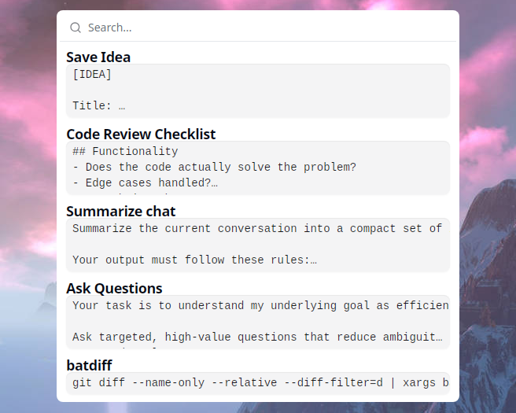
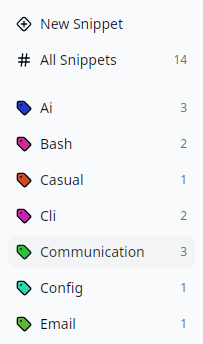
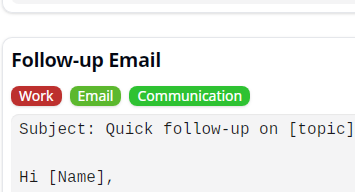
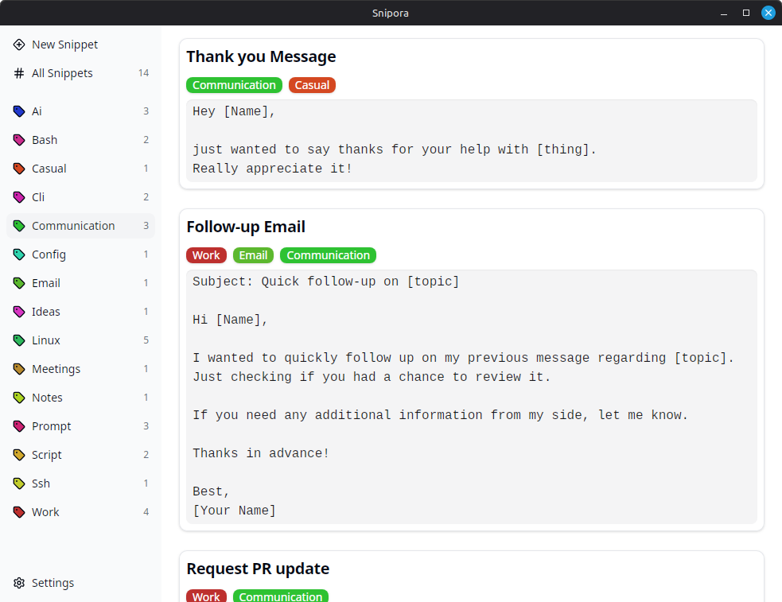

## ::pencil-off:: Stop rewriting the same things

You already repeat yourself more than you think:

- ::bot:: Rewriting prompts for AI tools like ChatGPT, Claude, or others
- ::message-square-reply:: Copy-pasting email replies or support answers
- ::scroll-text:: Losing useful text in your clipboard history

## ::clipboard-clock:: Snipora keeps it simple

Press a ::command:: shortcut. ::search:: Search. ::type-outline:: Insert. ::check:: Done.

- ::scan-search:: Open a global search popup from anywhere
- ::square-dashed-text:: Find snippets instantly as you type
- ::clipboard-paste:: Insert text without leaving your current app

{.rounded-xl}

## ::user:: Use cases

### ::bot:: Prompt reuse

You wrote a prompt that works perfectly for your LLM, but saving and reusing it is annoying.

Store your best prompts in Snipora and access them instantly whenever you need them.

### ::send:: Reusable responses

You keep rewriting the same emails or support replies.

Save them once and reuse them whenever needed.

### ::clipboard-list:: Persistent clipboard

You copied something useful, but only need it later or occasionally.

Keep it in Snipora so it is always available.

## ::tag:: Simple organization without folders

Managing snippets in files or note tools quickly becomes messy.

- ::tag:: Organize with tags instead of folders
- ::tags:: Assign multiple tags without deciding on a single place
- ::search:: Find what you need without navigating structures

{.rounded-lg}

{.rounded-lg}

## Why Snipora ::snipora::

- ::cloud-off:: Local-first
- ::circle-user-round:: No account required
- ::rabbit:: Instant access with a shortcut
- ::feather:: Lightweight and focused
- ::code-xml:: Open source

## Get started

Snipora is currently in early development. No official builds are available yet.

- [::social/github:: github.com/snipora/snipora](https://github.com/snipora/snipora)
- See the [::download:: download page](/download)

---

{.rounded-lg}

