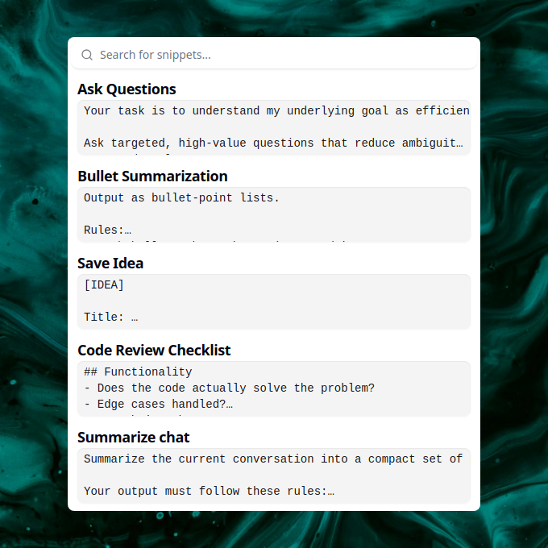
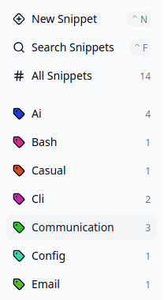
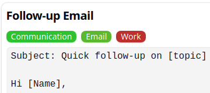
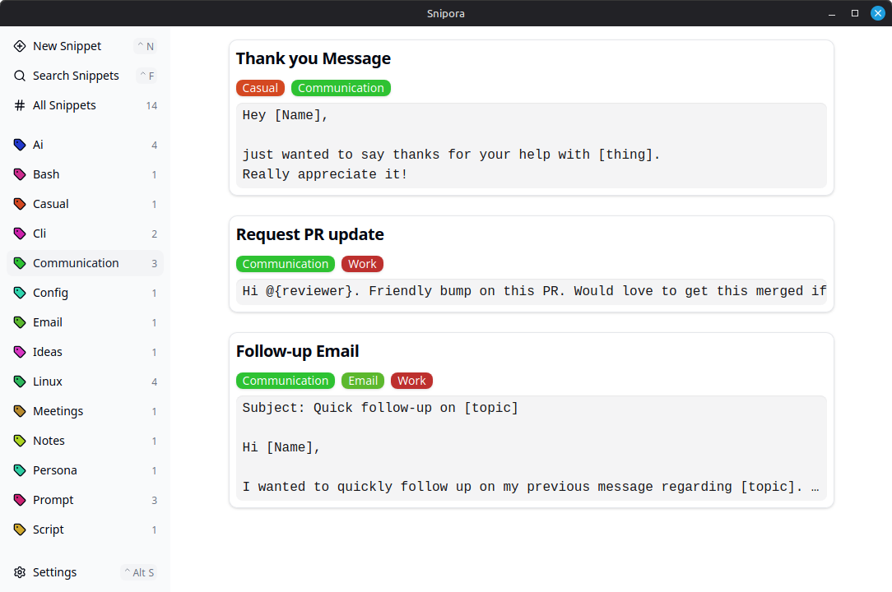

## ::pencil-off:: Stop rewriting the same things

You already repeat yourself more than you think:

- ::bot:: Rewriting prompts for AI tools like ChatGPT, Claude, or others
- ::message-square-reply:: Copy-pasting email replies or support answers
- ::scroll-text:: Losing useful text in your clipboard history

## ::snipora:: Snipora keeps it simple

Press a ::command:: shortcut. ::search:: Search. ::type-outline:: Insert. ::check:: Done!

- ::scan-search:: Open a global search popup from anywhere
- ::square-dashed-text:: Find snippets instantly as you type
- ::clipboard-paste:: Insert text without leaving your current app

{.rounded-xl}

## ::user:: Use cases

### ::bot:: Prompt reuse

You wrote a prompt that works perfectly for your LLM, but saving and reusing it is annoying?

Store your best prompts in Snipora and access them instantly whenever you need them!

### ::send:: Reusable responses

You keep rewriting the same emails or support replies?

Save them once and reuse them whenever needed!

### ::clipboard-list:: Persistent clipboard

You copied something useful, but only need it later or occasionally?

Keep it in Snipora so it is always available!

## ::tag:: Simple organization without folders

Managing snippets in files or note tools quickly becomes messy.

- ::tag:: Organize with tags instead of folders
- ::tags:: Assign multiple tags without deciding on a single place
- ::search:: Find what you need without navigating structures

{.rounded-lg}

{.rounded-lg}

## ::circle-question-mark:: Why Snipora

- ::cloud-off:: Local-first
- ::circle-user-round:: No account required
- ::rabbit:: Instant access with a shortcut
- ::feather:: Lightweight and focused
- ::code-xml:: Open source

## ::monitor-down:: Get started

[::download:: Download Snipora](download.md) and start saving time today!

> [!INFO]
> New to Snipora? Check out the [Getting Started](getting-started.md) guide to learn the basics in 2 minutes.

## ::heart::{.text-red-600} Support the Project

Snipora is an open-source project built by an individual. Here's how you can help:

- ::star::{.text-yellow-400} **Star the project** ::dot:: Show your support by starring [::snipora:: snipora/snipora](https://github.com/snipora/snipora) on ::social/github:: GitHub
- ::message-square-text:: **Suggest improvements** ::dot:: Have an idea? Open a discussion on ::social/github:: GitHub
- ::bug:: **Report issues** ::dot:: Found a bug? Let us know by opening an [::circle-dot:: Issue](https://github.com/snipora/snipora/issues)
- ::git-pull-request:: **Contribute** ::dot:: Pull requests are welcome!

## ::shield:: Why You Can Trust Snipora

Snipora is designed with your privacy and security in mind:

- ::wifi-off:: **No network permissions** ::dot:: Snipora works entirely offline. No data is sent to any server.
- ::database:: **Local storage only** ::dot:: Your snippets are stored locally on your device
- ::key:: **No account required** ::dot:: No login, no subscription, no tracking
- ::eye:: **Open source** ::dot:: Review the source code yourself on GitHub
- ::shield-check:: **Transparent development** ::dot:: All changes are visible in the [::gallery-vertical-end:: commit history](https://github.com/snipora/snipora/commits/main/)

---

{.rounded-lg}

